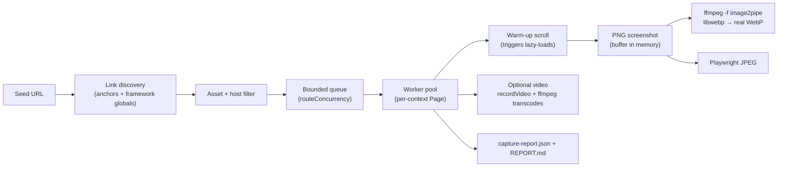
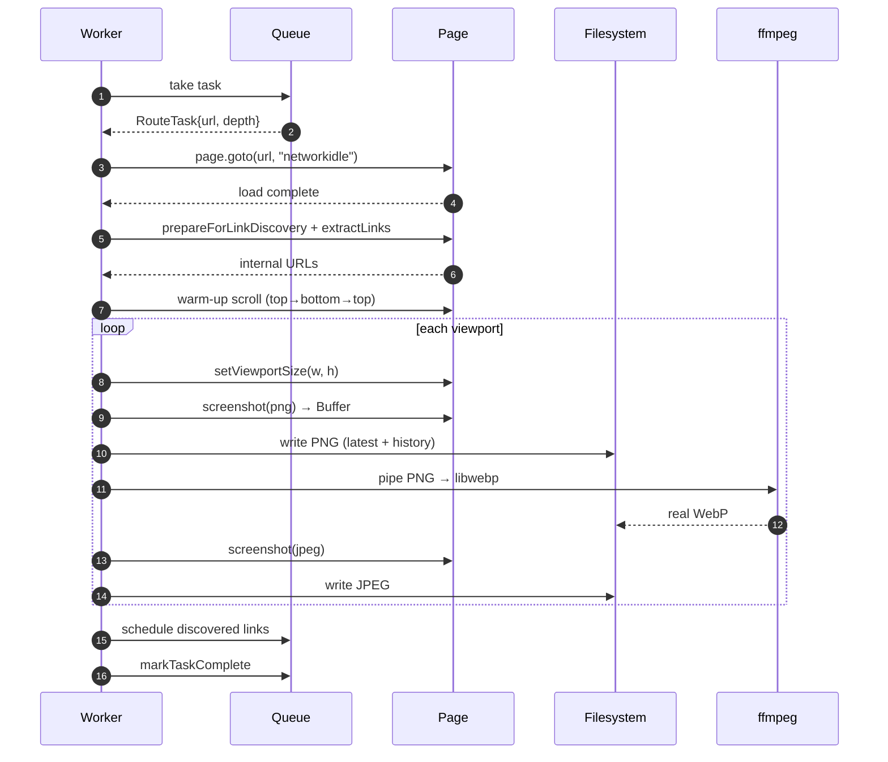
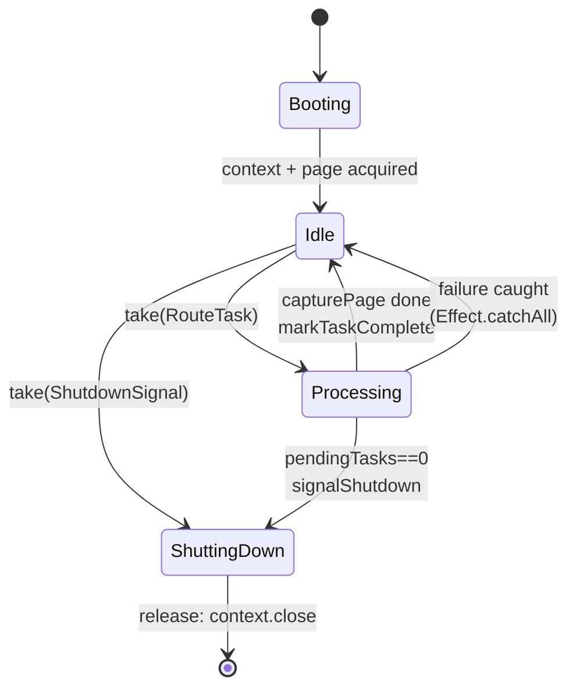
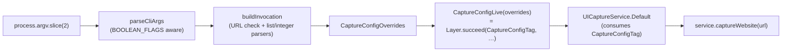
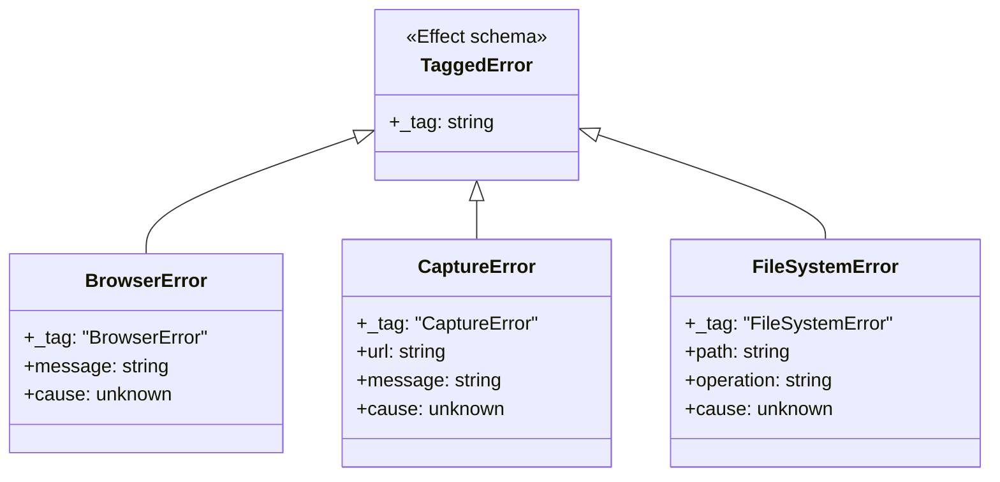

# ui-capture

<p align="center">
  <b>Crawl a website and capture full-page screenshots (PNG / real WebP / JPEG) and optional multi-quality videos for every reachable internal route — driven by Playwright, orchestrated by Effect.</b>
</p>

<p align="center">
  <a href="https://github.com/ElysiumOSS/ui-capture/actions/workflows/ci.yml"></a>
  <a href="https://github.com/ElysiumOSS/ui-capture/actions/workflows/docs.yml"></a>
  <a href="https://www.npmjs.com/package/@elysiumoss/ui-capture"></a>
  <a href="https://www.npmjs.com/package/@elysiumoss/ui-capture"></a>
  <a href="https://github.com/ElysiumOSS/ui-capture/blob/main/LICENSE.md"></a>
</p>

<p align="center">
  <a href="https://elysiumoss.github.io/ui-capture/">📖 API docs</a>
  ·
  <a href="https://github.com/ElysiumOSS/ui-capture/releases">🏷️ Releases</a>
  ·
  <a href="https://github.com/ElysiumOSS/ui-capture/issues">🐞 Issues</a>
</p>

---

## TL;DR

```bash
bun add -g @elysiumoss/ui-capture
bunx playwright install chromium

ui-capture https://example.com --max-depth 1 --video
```

Outputs land in `./ui-captures/` with `REPORT.md`, `capture-report.json`, and per-route screenshots / videos at every configured viewport.

## Pipeline



### Per-route capture sequence



### Worker pool lifecycle



### CLI argv → CaptureConfig flow



## Why

- **Real WebP**, not JPEG-with-a-`.webp`-extension.
  One PNG capture per page is piped through `ffmpeg --libwebp` for a real WebP, plus Playwright's native JPEG.
  Three formats, one screenshot.
- **Effect-driven** orchestration: structured concurrency, retries, predictable cleanup of browser contexts even on partial failure.
- **Framework-aware crawl**: pulls links from anchors *and* from common framework globals (`__NEXT_DATA__`, `__NUXT__`, `__SAPPER__`), then drops anything that looks like a static asset (`.css`, `.js`, `.svg`, `.webmanifest`, fonts, media, archives).
- **Pre-screenshot warm-up scroll** triggers IntersectionObserver-based lazy-loads and scroll-reveal animations so screenshots capture real content instead of skeletons.
- **Multi-quality video** (optional): Playwright's `recordVideo` master at 1×, plus `ffmpeg --libvpx-vp9` transcodes at 0.75× and 0.5× scale.

## Requirements

- [Bun](https://bun.sh/) ≥ 1.x or Node ≥ 20.19
- Chromium (auto-installed once via `bunx playwright install chromium`)
- `ffmpeg` on `PATH` (or pass `--ffmpeg /path/to/binary`)

## Installation

```bash
# Global CLI
bun add -g @elysiumoss/ui-capture

# Or as a project dependency
bun add @elysiumoss/ui-capture
# or
npm i @elysiumoss/ui-capture
```

Then once per machine:

```bash
bunx playwright install chromium
```

## CLI

```text
Usage: ui-capture <url> [options]

Arguments:
  <url>                       Starting URL to crawl

Options:
  --output-dir <path>         Output directory (default: ./ui-captures)
  --max-depth <n>             Maximum crawl depth (default: 2)
  --wait <ms>                 Per-page wait after networkidle (default: 2000)
  --concurrency <n>           Parallel route workers (default: 2)
  --include-subdomains        Crawl subdomains of the starting host
  --allowed-hosts <a,b,...>   Extra allowed hostnames (comma separated)
  --viewports <spec,spec>     Viewport specs as name:WIDTHxHEIGHT
                              (default: desktop:1920x1080,tablet:768x1024,mobile:375x667)
  --hide <sel,sel,...>        CSS selectors to hide before screenshotting
  --menu-selectors <sel,...>  Selectors to click before link discovery
  --video                     Capture videos in addition to screenshots
  --video-duration <ms>       Video duration when --video (default: 10000)
  --no-interactions           Disable scripted scrolling during video
  --no-warmup                 Skip the pre-screenshot warm-up scroll
  --ffmpeg <path>             ffmpeg binary path (default: ffmpeg)
  --help                      Show this message

Examples:
  ui-capture https://example.com
  ui-capture https://example.com --video --max-depth 1 --concurrency 4
  ui-capture https://example.com --viewports desktop:1920x1080,mobile:390x844
  ui-capture https://example.com --hide ".cookie-banner,#chat-widget"
```

## Library

### Single capture

```ts
import { Effect } from "effect";
import {
  CaptureConfigLive,
  UICaptureService,
} from "@elysiumoss/ui-capture";

const program = Effect.gen(function* () {
  const service = yield* UICaptureService;
  return yield* service.captureWebsite("https://example.com");
}).pipe(
  Effect.provide(UICaptureService.Default),
  Effect.provide(
    CaptureConfigLive({
      outputDir: "./ui-captures",
      maxDepth: 1,
      captureVideo: true,
      viewports: [
        { name: "desktop", width: 1920, height: 1080 },
        { name: "mobile", width: 390, height: 844 },
      ],
    }),
  ),
);

const results = await Effect.runPromise(program);
console.log(`Captured ${results.size} routes`);
```

### Batch across multiple sites

```ts
import { Effect } from "effect";
import {
  CaptureConfigLive,
  UICaptureService,
} from "@elysiumoss/ui-capture";

const sites = [
  { url: "https://example.com", outputDir: "./out/example" },
  { url: "https://acme.test", outputDir: "./out/acme" },
];

for (const site of sites) {
  const program = Effect.gen(function* () {
    const svc = yield* UICaptureService;
    return yield* svc.captureWebsite(site.url);
  }).pipe(
    Effect.provide(UICaptureService.Default),
    Effect.provide(
      CaptureConfigLive({ outputDir: site.outputDir, maxDepth: 1 }),
    ),
  );
  await Effect.runPromise(program);
}
```

### Tagged-error handling

```ts
import { Effect } from "effect";
import {
  BrowserError,
  CaptureConfigLive,
  CaptureError,
  FileSystemError,
  UICaptureService,
} from "@elysiumoss/ui-capture";

const program = Effect.gen(function* () {
  const svc = yield* UICaptureService;
  return yield* svc.captureWebsite("https://example.com");
}).pipe(
  Effect.catchTag("BrowserError", (e: BrowserError) =>
    Effect.logError(`browser failed: ${e.message}`).pipe(Effect.as(null)),
  ),
  Effect.catchTag("CaptureError", (e: CaptureError) =>
    Effect.logError(`capture failed at ${e.url}: ${e.message}`).pipe(
      Effect.as(null),
    ),
  ),
  Effect.catchTag("FileSystemError", (e: FileSystemError) =>
    Effect.logError(`fs failed at ${e.path} (${e.operation})`).pipe(
      Effect.as(null),
    ),
  ),
  Effect.provide(UICaptureService.Default),
  Effect.provide(CaptureConfigLive({ outputDir: "./out" })),
);
```

### Error type hierarchy



All three errors are `S.TaggedError` subclasses, so they discriminate cleanly under `Effect.catchTag` / `Effect.catchTags`.

## Configuration reference

`CaptureConfig` fields and the matching CLI flag:

| Field                       | CLI flag                | Type                       | Default                            | Notes |
| --------------------------- | ----------------------- | -------------------------- | ---------------------------------- | ----- |
| `outputDir`                 | `--output-dir`          | `string`                   | `"ui-captures"`                    | Resolved against `cwd` when set via CLI. |
| `maxDepth`                  | `--max-depth`           | `int ≥ 0`                  | `2`                                | `0` captures only the seed URL. |
| `waitTime`                  | `--wait`                | `int ≥ 0` (ms)             | `2000`                             | Settle time after `networkidle`. |
| `routeConcurrency`          | `--concurrency`         | `int ≥ 1`                  | `2`                                | Worker pool size; each holds its own browser context. |
| `includeSubdomains`         | `--include-subdomains`  | `boolean`                  | `false`                            | Subdomain match excludes bare TLDs (no leak across `.com`). |
| `allowedHosts`              | `--allowed-hosts`       | `string[]`                 | `[]`                               | Extra hostnames in addition to the seed host. |
| `viewports`                 | `--viewports`           | `ViewportConfig[]`         | desktop / tablet / mobile defaults | Each viewport produces its own PNG/WebP/JPEG triple. |
| `captureVideo`              | `--video`               | `boolean`                  | `false`                            | Video adds 5–15 s per route × per viewport. |
| `videoOptions.duration`     | `--video-duration`      | `int ≥ 1` (ms)             | `10000`                            | Total recorded duration for the master capture. |
| `videoOptions.interactions` | `--no-interactions` (¬) | `boolean`                  | `true`                             | Auto-scrolls during recording so dynamic content shows. |
| `warmupScroll`              | `--no-warmup` (¬)       | `boolean`                  | `true`                             | Top→bottom→top scroll before each shot to trigger lazy loads. |
| `screenshotHideSelectors`   | `--hide`                | `string[]` (CSS selectors) | `[]`                               | Hidden via injected `visibility:hidden` style during capture. |
| `menuInteractionSelectors`  | `--menu-selectors`      | `string[]`                 | `[]`                               | Clicked before link discovery for collapsed nav menus. |
| `ffmpegPath`                | `--ffmpeg`              | `string`                   | `"ffmpeg"`                         | Absolute path or anything on `PATH`. |

`(¬)` means the CLI flag *negates* the default — e.g. `--no-warmup` sets `warmupScroll: false`.

## Output layout

```text
ui-captures/
├── REPORT.md
├── capture-report.json
└── <route-slug>/
    ├── screenshots/
    │   ├── png/
    │   │   ├── desktop_1920x1080_latest.png
    │   │   └── history/desktop_1920x1080_<timestamp>.png
    │   ├── webp/                              # real WebP via libwebp
    │   │   ├── desktop_1920x1080_latest.webp
    │   │   └── history/...
    │   └── jpg/
    │       ├── desktop_1920x1080_latest.jpg
    │       └── history/...
    └── videos/                                # only when --video
        ├── high-quality/desktop_1920x1080_<ts>.webm    # 1.0× scale, master
        ├── medium-quality/...                          # 0.75× scale, ffmpeg transcode
        └── low-quality/...                             # 0.5×  scale, ffmpeg transcode
```

The `<route-slug>` is the URL pathname slugified to filesystem-friendly characters; `/` becomes `root`.

## `capture-report.json` shape

```ts
type CaptureReport = {
  timestamp: string;          // ISO-8601
  totalRoutes: number;
  successfulCaptures: number;
  failedCaptures: number;
  viewports: { name: string; width: number; height: number }[];
  results: Array<{
    url: string;
    route: string;            // route-slug
    screenshots: string[];    // viewport names that produced a triple
    hasVideo: boolean;
    error?: string;
  }>;
};
```

## Notes & gotchas

- **Asset filtering** — link discovery skips URLs whose pathname ends in common asset extensions so frameworks that expose chunk paths in `__NEXT_DATA__` don't poison the crawl queue.
- **Warm-up scroll** — before each screenshot pass, the page is scrolled top → bottom in steps and back, triggering IntersectionObserver-based lazy-loads and scroll-reveal animations.
  Disable with `--no-warmup` if it interferes with state-machine sites.
- **Parallax** — true scroll-progress-driven parallax (pinned + transformed elements) renders at scroll=0 once warm-up returns to top.
  A stitched-capture mode for that case is on the roadmap.
- **Headless cleanup** — every browser context is closed in `Effect.acquireUseRelease` releases, so partial failures don't leak Chromium processes.
- **`provenance: true`** — npm publishes are signed with GitHub Actions OIDC; verify with `npm audit signatures`.

## Testing

The repo ships with two suites:

- **Unit suite** — `bun run test` — 43 tests across argument parsing, schema defaults / overrides, host-filter, URL utils, and CLI → config wiring.
  Runs in under a second.
- **Integration suite** — `bun run test:integration` — spins up a localhost HTML fixture, drives the full Effect pipeline through one viewport, and asserts that PNG / WebP / JPEG / `REPORT.md` / `capture-report.json` all land.
  Gated by `RUN_INTEGRATION=1` so it only runs when explicitly requested.

## Roadmap

- Stitched-capture mode for true scroll-progress parallax (`--stitched`)
- Pre-built Chromium installer step in CI for opt-in integration runs
- HAR-aware capture (replay network from a fixture)
- Per-route action scripts (login, dismiss modal, etc.)

## Contributing

PRs welcome.
Please run `bun run lint && bun run test --run` before opening one.

## License

MIT — see [LICENSE.md](./LICENSE.md).
