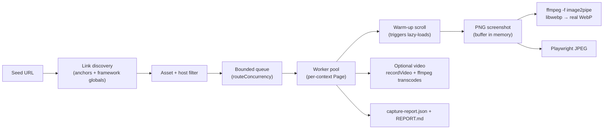
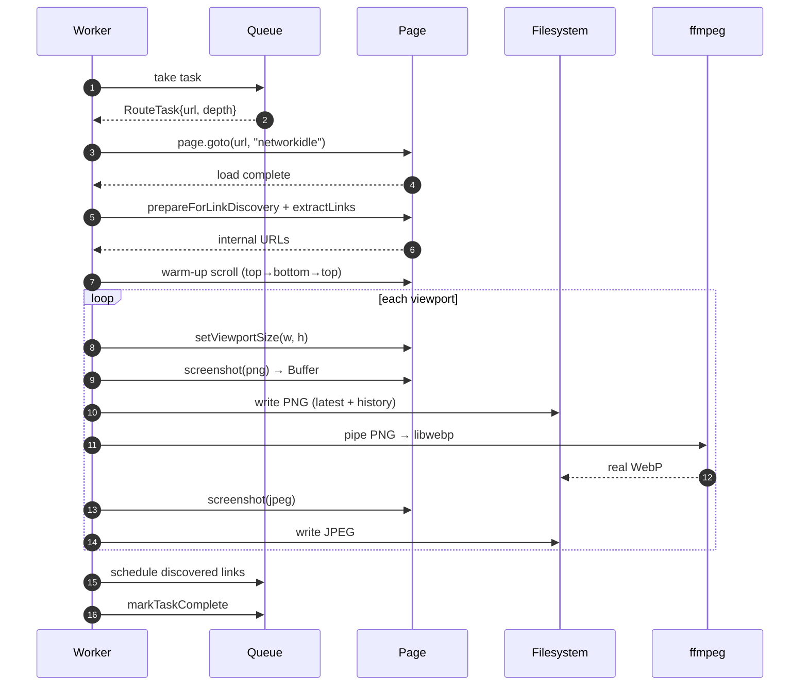
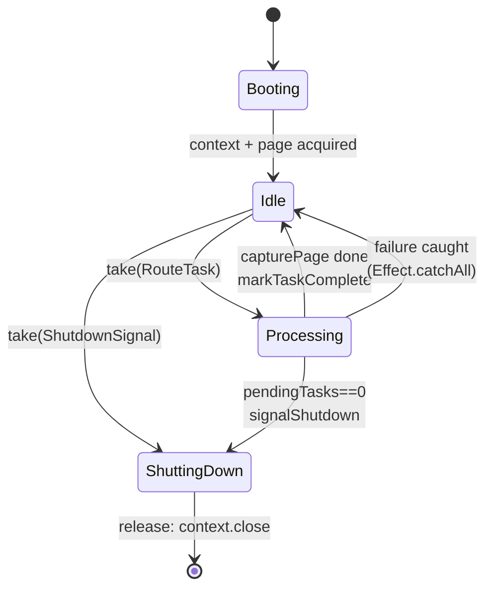
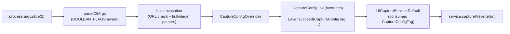
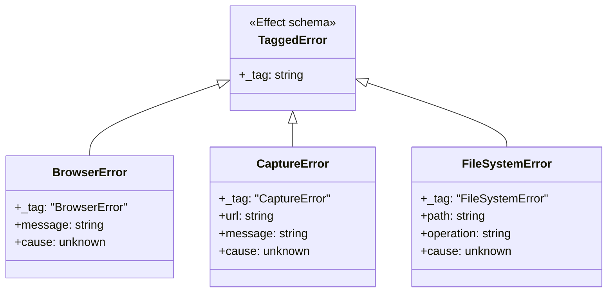

# ui-capture

<p align="center">
  <b>Crawl a website and capture full-page screenshots (PNG / real WebP / JPEG) and optional multi-quality videos for every reachable internal route — driven by Playwright, orchestrated by Effect.</b>
</p>

<p align="center">
  <a href="https://github.com/ElysiumOSS/ui-capture/actions/workflows/ci.yml"></a>
  <a href="https://github.com/ElysiumOSS/ui-capture/actions/workflows/docs.yml"></a>
  <a href="https://www.npmjs.com/package/@elysiumoss/ui-capture"></a>
  <a href="https://www.npmjs.com/package/@elysiumoss/ui-capture"></a>
  <a href="https://github.com/ElysiumOSS/ui-capture/blob/main/LICENSE.md"></a>
</p>

<p align="center">
  <a href="https://elysiumoss.github.io/ui-capture/">📖 API docs</a>
  ·
  <a href="https://github.com/ElysiumOSS/ui-capture/releases">🏷️ Releases</a>
  ·
  <a href="https://github.com/ElysiumOSS/ui-capture/issues">🐞 Issues</a>
</p>

---

## TL;DR

```bash
bun add -g @elysiumoss/ui-capture
bunx playwright install chromium

ui-capture https://example.com --max-depth 1 --video
```

Outputs land in `./ui-captures/` with `REPORT.md`, `capture-report.json`, and per-route screenshots / videos at every configured viewport.

## Pipeline


```mermaid
flowchart LR
  Seed["Seed URL"] --> Discover["Link discovery<br/>(anchors + framework globals)"]
  Discover --> Filter["Asset + host filter"]
  Filter --> Queue["Bounded queue<br/>(routeConcurrency)"]
  Queue --> Workers["Worker pool<br/>(per-context Page)"]
  Workers --> Warmup["Warm-up scroll<br/>(triggers lazy-loads)"]
  Warmup --> Shots["PNG screenshot<br/>(buffer in memory)"]
  Shots --> Pipe["ffmpeg -f image2pipe<br/>libwebp → real WebP"]
  Shots --> Jpg["Playwright JPEG"]
  Workers --> Video["Optional video<br/>recordVideo + ffmpeg transcodes"]
  Workers --> Report["capture-report.json + REPORT.md"]
```

### Per-route capture sequence


```mermaid
sequenceDiagram
    autonumber
    participant W as Worker
    participant Q as Queue
    participant P as Page
    participant FS as Filesystem
    participant FF as ffmpeg

    W->>Q: take task
    Q-->>W: RouteTask{url, depth}
    W->>P: page.goto(url, "networkidle")
    P-->>W: load complete
    W->>P: prepareForLinkDiscovery + extractLinks
    P-->>W: internal URLs
    W->>P: warm-up scroll (top→bottom→top)
    loop each viewport
        W->>P: setViewportSize(w, h)
        W->>P: screenshot(png) → Buffer
        W->>FS: write PNG (latest + history)
        W->>FF: pipe PNG → libwebp
        FF-->>FS: real WebP
        W->>P: screenshot(jpeg)
        W->>FS: write JPEG
    end
    W->>Q: schedule discovered links
    W->>Q: markTaskComplete
```

### Worker pool lifecycle


```mermaid
stateDiagram-v2
    [*] --> Booting
    Booting --> Idle: context + page acquired
    Idle --> Processing: take(RouteTask)
    Processing --> Idle: capturePage done<br/>markTaskComplete
    Processing --> Idle: failure caught<br/>(Effect.catchAll)
    Idle --> ShuttingDown: take(ShutdownSignal)
    Processing --> ShuttingDown: pendingTasks==0<br/>signalShutdown
    ShuttingDown --> [*]: release: context.close
```

### CLI argv → CaptureConfig flow


```mermaid
flowchart LR
  argv["process.argv.slice(2)"] --> parse["parseCliArgs<br/>(BOOLEAN_FLAGS aware)"]
  parse --> build["buildInvocation<br/>(URL check + list/integer parsers)"]
  build --> over["CaptureConfigOverrides"]
  over --> live["CaptureConfigLive(overrides)<br/>= Layer.succeed(CaptureConfigTag, …)"]
  live --> svc["UICaptureService.Default<br/>(consumes CaptureConfigTag)"]
  svc --> cap["service.captureWebsite(url)"]
```

## Why

- **Real WebP**, not JPEG-with-a-`.webp`-extension.
  One PNG capture per page is piped through `ffmpeg --libwebp` for a real WebP, plus Playwright's native JPEG.
  Three formats, one screenshot.
- **Effect-driven** orchestration: structured concurrency, retries, predictable cleanup of browser contexts even on partial failure.
- **Framework-aware crawl**: pulls links from anchors *and* from common framework globals (`__NEXT_DATA__`, `__NUXT__`, `__SAPPER__`), then drops anything that looks like a static asset (`.css`, `.js`, `.svg`, `.webmanifest`, fonts, media, archives).
- **Pre-screenshot warm-up scroll** triggers IntersectionObserver-based lazy-loads and scroll-reveal animations so screenshots capture real content instead of skeletons.
- **Multi-quality video** (optional): Playwright's `recordVideo` master at 1×, plus `ffmpeg --libvpx-vp9` transcodes at 0.75× and 0.5× scale.

## Requirements

- [Bun](https://bun.sh/) ≥ 1.x or Node ≥ 20.19
- Chromium (auto-installed once via `bunx playwright install chromium`)
- `ffmpeg` on `PATH` (or pass `--ffmpeg /path/to/binary`)

## Installation

```bash
# Global CLI
bun add -g @elysiumoss/ui-capture

# Or as a project dependency
bun add @elysiumoss/ui-capture
# or
npm i @elysiumoss/ui-capture
```

Then once per machine:

```bash
bunx playwright install chromium
```

## CLI

```text
Usage: ui-capture <url> [options]

Arguments:
  <url>                       Starting URL to crawl

Options:
  --output-dir <path>         Output directory (default: ./ui-captures)
  --max-depth <n>             Maximum crawl depth (default: 2)
  --wait <ms>                 Per-page wait after networkidle (default: 2000)
  --concurrency <n>           Parallel route workers (default: 2)
  --include-subdomains        Crawl subdomains of the starting host
  --allowed-hosts <a,b,...>   Extra allowed hostnames (comma separated)
  --viewports <spec,spec>     Viewport specs as name:WIDTHxHEIGHT
                              (default: desktop:1920x1080,tablet:768x1024,mobile:375x667)
  --hide <sel,sel,...>        CSS selectors to hide before screenshotting
  --menu-selectors <sel,...>  Selectors to click before link discovery
                              (this opens menus so links become discoverable;
                              it is not a capture-state mechanism — see
                              --states for that)
  --states <path>             JSON file of named interaction scripts. Each
                              named state is performed on a fresh page load
                              and yields its own capture set, so a single-route
                              app's dialogs and workspaces get captured too.
  --state-filter <a,b,...>    Capture only these named states (default: all).
                              A state they extend is replayed to reach them,
                              and is not captured itself.
  --skip-routes               Capture only scripted states, not crawled routes
  --state-timeout <ms>        Budget for reaching a state: navigation,
                              precondition probe and script. Screenshot and
                              video capture are outside it (default: 60000;
                              a state may override it with timeoutMs)
  --precondition-timeout <ms> Budget for a state's precondition probe, which
                              decides whether the state exists on this build
                              at all (default: 10000; a state may override it
                              with preconditionTimeoutMs). Raise it for an app
                              whose first meaningful frame lands well after
                              networkidle, such as a WebGL console — a probe
                              that gives up first records the state as skipped
                              rather than slow.
  --allow-state-requests      Permit request steps, which reach past the UI
                              into the app's own backend. Off by default: a
                              states file from a colleague should not be able
                              to POST to your app because you ran the tool.
  --fail-on-state-error       Exit non-zero when any scripted state failed
  --video                     Capture videos in addition to screenshots
  --video-duration <ms>       Video duration when --video (default: 10000)
  --no-interactions           Disable scripted scrolling during video
  --color-scheme <scheme>     prefers-color-scheme to report: light, dark, or
                              no-preference (default: light). A site that
                              follows the OS theme renders light under headless
                              Chromium, so pass dark to capture its dark face.
  --no-warmup                 Skip the pre-screenshot warm-up scroll
                              (warm-up triggers lazy-load + scroll-reveal
                              animations so screenshots capture real content)
  --ffmpeg <path>             ffmpeg binary path (default: ffmpeg)
  --launch-args <args>        Extra Chromium switches, whitespace separated
                              (e.g. to enable an experimental web platform
                              feature the captured page depends on)
  --help                      Show this message

Examples:
  ui-capture https://example.com
  ui-capture https://example.com --video --max-depth 1 --concurrency 4
  ui-capture https://example.com --viewports desktop:1920x1080,mobile:390x844
  ui-capture https://example.com --hide ".cookie-banner,#chat-widget"
  ui-capture https://example.com --color-scheme dark
  ui-capture https://example.com --launch-args "--enable-blink-features=CanvasDrawElement"
  ui-capture http://localhost:5173 --max-depth 0 --states ./ui-capture.states.json
  ui-capture http://localhost:5173 --states ./states.json --state-filter fleet-editor
```

## Library

### Single capture

```ts
import { Effect } from "effect";
import {
  CaptureConfigLive,
  UICaptureService,
} from "@elysiumoss/ui-capture";

const program = Effect.gen(function* () {
  const service = yield* UICaptureService;
  return yield* service.captureWebsite("https://example.com");
}).pipe(
  Effect.provide(UICaptureService.Default),
  Effect.provide(
    CaptureConfigLive({
      outputDir: "./ui-captures",
      maxDepth: 1,
      captureVideo: true,
      viewports: [
        { name: "desktop", width: 1920, height: 1080 },
        { name: "mobile", width: 390, height: 844 },
      ],
    }),
  ),
);

const results = await Effect.runPromise(program);
console.log(`Captured ${results.size} routes`);
```

### Batch across multiple sites

```ts
import { Effect } from "effect";
import {
  CaptureConfigLive,
  UICaptureService,
} from "@elysiumoss/ui-capture";

const sites = [
  { url: "https://example.com", outputDir: "./out/example" },
  { url: "https://acme.test", outputDir: "./out/acme" },
];

for (const site of sites) {
  const program = Effect.gen(function* () {
    const svc = yield* UICaptureService;
    return yield* svc.captureWebsite(site.url);
  }).pipe(
    Effect.provide(UICaptureService.Default),
    Effect.provide(
      CaptureConfigLive({ outputDir: site.outputDir, maxDepth: 1 }),
    ),
  );
  await Effect.runPromise(program);
}
```

### Tagged-error handling

```ts
import { Effect } from "effect";
import {
  BrowserError,
  CaptureConfigLive,
  CaptureError,
  FileSystemError,
  UICaptureService,
} from "@elysiumoss/ui-capture";

const program = Effect.gen(function* () {
  const svc = yield* UICaptureService;
  return yield* svc.captureWebsite("https://example.com");
}).pipe(
  Effect.catchTag("BrowserError", (e: BrowserError) =>
    Effect.logError(`browser failed: ${e.message}`).pipe(Effect.as(null)),
  ),
  Effect.catchTag("CaptureError", (e: CaptureError) =>
    Effect.logError(`capture failed at ${e.url}: ${e.message}`).pipe(
      Effect.as(null),
    ),
  ),
  Effect.catchTag("FileSystemError", (e: FileSystemError) =>
    Effect.logError(`fs failed at ${e.path} (${e.operation})`).pipe(
      Effect.as(null),
    ),
  ),
  Effect.provide(UICaptureService.Default),
  Effect.provide(CaptureConfigLive({ outputDir: "./out" })),
);
```

### Error type hierarchy


```mermaid
classDiagram
    class TaggedError {
        <<Effect schema>>
        +_tag: string
    }
    class BrowserError {
        +_tag: "BrowserError"
        +message: string
        +cause: unknown
    }
    class CaptureError {
        +_tag: "CaptureError"
        +url: string
        +message: string
        +cause: unknown
    }
    class FileSystemError {
        +_tag: "FileSystemError"
        +path: string
        +operation: string
        +cause: unknown
    }
    TaggedError <|-- BrowserError
    TaggedError <|-- CaptureError
    TaggedError <|-- FileSystemError
```

All three errors are `S.TaggedError` subclasses, so they discriminate cleanly under `Effect.catchTag` / `Effect.catchTags`.

## Configuration reference

`CaptureConfig` fields and the matching CLI flag:

| Field                       | CLI flag                | Type                       | Default                            | Notes |
| --------------------------- | ----------------------- | -------------------------- | ---------------------------------- | ----- |
| `outputDir`                 | `--output-dir`          | `string`                   | `"ui-captures"`                    | Resolved against `cwd` when set via CLI. |
| `maxDepth`                  | `--max-depth`           | `int ≥ 0`                  | `2`                                | `0` captures only the seed URL. |
| `waitTime`                  | `--wait`                | `int ≥ 0` (ms)             | `2000`                             | Settle time after `networkidle`. |
| `routeConcurrency`          | `--concurrency`         | `int ≥ 1`                  | `2`                                | Worker pool size; each holds its own browser context. |
| `includeSubdomains`         | `--include-subdomains`  | `boolean`                  | `false`                            | Subdomain match excludes bare TLDs (no leak across `.com`). |
| `allowedHosts`              | `--allowed-hosts`       | `string[]`                 | `[]`                               | Extra hostnames in addition to the seed host. |
| `viewports`                 | `--viewports`           | `ViewportConfig[]`         | desktop / tablet / mobile defaults | Each viewport produces its own PNG/WebP/JPEG triple. |
| `captureVideo`              | `--video`               | `boolean`                  | `false`                            | Video adds 5–15 s per route × per viewport. |
| `videoOptions.duration`     | `--video-duration`      | `int ≥ 1` (ms)             | `10000`                            | Total recorded duration for the master capture. |
| `videoOptions.interactions` | `--no-interactions` (¬) | `boolean`                  | `true`                             | Auto-scrolls during recording so dynamic content shows. |
| `warmupScroll`              | `--no-warmup` (¬)       | `boolean`                  | `true`                             | Top→bottom→top scroll before each shot to trigger lazy loads. |
| `screenshotHideSelectors`   | `--hide`                | `string[]` (CSS selectors) | `[]`                               | Hidden via injected `visibility:hidden` style during capture. |
| `menuInteractionSelectors`  | `--menu-selectors`      | `string[]`                 | `[]`                               | Clicked before link discovery for collapsed nav menus. |
| `colorScheme`               | `--color-scheme`        | `"light" \| "dark" \| "no-preference"` | `"light"`              | The `prefers-color-scheme` reported to the page, applied to both the screenshot and video contexts; the default matches Playwright's, so existing captures are unchanged. |
| `ffmpegPath`                | `--ffmpeg`              | `string`                   | `"ffmpeg"`                         | Absolute path or anything on `PATH`. |
| `launchArgs`                | `--launch-args`         | `string[]`                 | `[]`                               | Appended after the baseline switches so they win on conflict; the CLI value splits on whitespace rather than commas, since one switch may itself contain commas. |
| `states`                    | `--states`              | `CaptureState[]`           | `[]`                               | Named interaction scripts, each yielding its own capture set; empty by default, so a run without a states file behaves exactly as it always has. |
| `stateTimeout`              | `--state-timeout`       | `int ≥ 1` (ms)             | `60000`                            | Budget for *reaching* a state — navigation, the `precondition` probe and the script; screenshot and video capture sit outside it, and a state may override it with its own `timeoutMs`. |
| `preconditionTimeout`       | `--precondition-timeout`| `int ≥ 1` (ms)             | `10000`                            | Budget for a state's `precondition` probe: long enough for an app whose first meaningful frame lands after `networkidle` — a probe that gives up first records the state as `skipped` rather than slow — and short enough that a state which genuinely is not here skips cheaply; a state may override it with its own `preconditionTimeoutMs`. |
| `captureRoutes`             | `--skip-routes` (¬)     | `boolean`                  | `true`                             | Set `false` to capture only scripted states, for an app whose boot view is a loading spinner. |
| `allowStateRequests`        | `--allow-state-requests`| `boolean`                  | `false`                            | Gate on `request` steps, checked at load time *and* in the service so a programmatic caller cannot skip it. |

`(¬)` means the CLI flag *negates* the default — e.g. `--no-warmup` sets `warmupScroll: false`.

## Scripted states

A route crawler cannot capture a single-route application.
Point this tool at a Three.js operator console — one URL, whose spawn dialog, environment dialog and populated fleet exist only after interaction — and it produces one screenshot of the boot view and reports the site fully covered.
That is worse than useless: it looks like coverage.

Scripted states fix that.
A state is a named, declarative interaction script performed on the page before capture, and each state yields its own capture set.
States are first-class peers of routes: same queue, same worker pool, same `--concurrency`, same results map, same report.

### The states file

```json
{
  "version": 1,
  "states": [
    {
      "name": "spawn-dialog",
      "description": "Drone spawn dialog, fixed-wing preset selected",
      "steps": [
        { "kind": "waitFor", "selector": "canvas[data-scene-ready]", "timeoutMs": 20000 },
        { "kind": "click",   "selector": "[data-testid='spawn-drone']", "settleMs": 400 },
        { "kind": "waitFor", "selector": "dialog#spawn", "state": "visible" },
        { "kind": "select",  "selector": "#drone-type", "values": ["fixed-wing"] },
        { "kind": "fill",    "selector": "#callsign", "value": "RESQ-01" }
      ]
    },
    {
      "name": "fleet-multidomain",
      "description": "Six drones across air/ground/marine, seeded via the app's own API",
      "steps": [
        { "kind": "waitFor", "selector": "[data-app-ready]" },
        { "kind": "request", "method": "POST", "path": "/api/sim/seed",
          "json": { "preset": "multidomain", "count": 6 }, "expectStatus": 201 },
        { "kind": "reload" },
        { "kind": "waitFor", "selector": ".fleet-row", "minCount": 6, "timeoutMs": 30000 }
      ]
    },
    {
      "name": "fleet-editor",
      "extends": "fleet-multidomain",
      "viewports": ["desktop"],
      "steps": [
        { "kind": "click",   "selector": "[data-panel='editor']" },
        { "kind": "waitFor", "selector": ".editor-root .cm-content" }
      ]
    },
    {
      "name": "safety-advanced",
      "url": "/console?mode=advanced",
      "precondition": "nav [data-tab='safety']",
      "timeoutMs": 45000,
      "steps": [
        { "kind": "click",   "selector": "#consent-dismiss", "optional": true },
        { "kind": "click",   "selector": "nav [data-tab='safety']" },
        { "kind": "waitFor", "selector": "[data-geofence-warning]" }
      ]
    }
  ]
}
```

`version` is required rather than defaulted.
The step vocabulary becomes a public JSON format on files on other people's disks the day it ships, and a discriminant is the only cheap way to land a v2 that renames a kind without guessing at an unversioned file's intent.

`name` is constrained to `^[a-z0-9][a-z0-9-]*$` because it becomes a directory component.
Rejecting loudly beats slugifying two states into one directory, and lowercase-only keeps `Spawn` and `spawn` from colliding on a case-insensitive filesystem.

### State fields

| Field | Type | Default | What it does |
| ----- | ---- | ------- | ------------ |
| `name` | `string` matching `^[a-z0-9][a-z0-9-]*$` | *required* | Identifies the state, and names its output directory. |
| `steps` | `CaptureStep[]` | *required* | The script, run in order on a fresh page load. |
| `description` | `string` | — | Free text; carried for the reader, not used by the tool. |
| `url` | `string` | the seed URL | Absolute, or relative to the seed URL, and confined to an allowed **origin** — scheme, host and port all compared, with the host filter deciding the host and the seed deciding the scheme and port. |
| `extends` | `string` | — | Another state's name, whose steps are prepended to this one's; `url` and `allowVideoReplay` are inherited with them, and chains deeper than five links are rejected. |
| `precondition` | `string` (CSS selector) | — | Probed on the fresh load before any step; absent means the state is recorded `skipped` rather than `failed`, while a selector that cannot be *evaluated* is neither — the state fails. |
| `preconditionTimeoutMs` | `int ≥ 1` | `--precondition-timeout` (10000) | Budget for this state's probe, for UI that is ready at first paint or, at the other end, several seconds after it. |
| `viewports` | `string[]` (at least one) | every configured viewport | Restrict the state to named viewports, for UI that does not exist at every breakpoint; an empty array is rejected, because it would capture nothing and still be reported as captured, so omit the field to use every configured viewport. |
| `timeoutMs` | `int ≥ 1` | `--state-timeout` (60000) | Budget for reaching the state: navigation, the `precondition` probe and the script; capture sits outside it. |
| `allowVideoReplay` | `boolean` | `false` | Record video for a state whose script contains a `request` step, when that seed is idempotent; inherited through `extends`, because the `request` step that triggers the suppression is inherited too. |

### Running it

```bash
ui-capture http://localhost:5173 \
  --max-depth 0 \
  --states ./ui-capture.states.json \
  --state-timeout 45000 \
  --allow-state-requests \
  --viewports desktop:1920x1080,mobile:390x844 \
  --launch-args "--use-gl=angle --use-angle=swiftshader" \
  --fail-on-state-error
```

That run captures the boot view once as a route, then each state once as its own set:

```text
ui-captures/
├── REPORT.md
├── capture-report.json
├── root/                                 # the seed route, crawled as always
│   ├── screenshots/                      #   the boot view
│   └── states/
│       ├── spawn-dialog/screenshots/     #   desktop + mobile
│       ├── fleet-multidomain/screenshots/
│       └── fleet-editor/screenshots/     #   desktop only, per its viewports filter
└── console/                              # safety-advanced set url: /console?mode=advanced
    └── states/
        └── safety-advanced/screenshots/
```

Each `screenshots/` directory holds the same `png/` `webp/` `jpg/` triple a route capture produces, so nothing downstream has to special-case a state.
`--skip-routes` drops `root/screenshots/` and captures only the four state sets, for an app whose boot view is a loading spinner.
`--state-filter fleet-editor` runs one state, which is how you iterate on a script you are still writing.
A filter selects *capture targets*, not a subgraph: if `fleet-editor` extends `fleet-multidomain`, the parent's steps are folded into `fleet-editor` and replayed, but `fleet-multidomain` is not itself captured and its own steps — a `request` seed among them — do not run a second time as a state of their own.

If `fleet-editor`'s last `waitFor` never resolves, the run still finishes: the other three states capture, `root/states/fleet-editor/` is created and left empty, `REPORT.md` gains a row naming the failing step, and `--fail-on-state-error` makes the process exit non-zero so CI does not go green on a state that never rendered.

### Step vocabulary

| Kind | Fields | What it is for |
| ---- | ------ | -------------- |
| `waitFor` | `selector`, `state?` (`visible` \| `hidden` \| `attached` \| `detached`, default `visible`), `minCount?` (with `visible` or `attached` only) | Readiness, and the assertion mechanism, because the load event is a lie in an SPA; `minCount` exists so waiting for *one* `.fleet-row` cannot shoot a half-populated fleet. |
| `wait` | `ms` | The crude one, and the only honest tool for a WebGL scene whose intro tween has no DOM correlate; prefer `settleMs`, or a `waitFor` on a readiness attribute. |
| `click` | `selector`, `nth?` (zero-based) | Opens the dialog, the tab, the workspace; Playwright auto-scrolls and auto-waits for actionability. |
| `fill` | `selector`, `value` | Callsigns, coordinates, waypoints; also handles `contenteditable`. |
| `select` | `selector`, `values` | Native `<select>` only — Chromium renders its option list in an OS-level popup that DOM clicks cannot reach, so this is not redundant with `click`. |
| `press` | `key`, `selector?` | Escape to close, Enter to submit, Tab to move focus — none reachable by clicking. |
| `request` | `method`, `path`, `json?`, `headers?`, `expectStatus?` | Seeds state through the app's own API, using the page's browser context so it inherits the session cookie; requires `--allow-state-requests`. |
| `reload` | `waitUntil?` (default `networkidle`) | Re-enters the app against new server state; `[request, reload, waitFor]` is the canonical seeding idiom. |

Every step also accepts three modifiers: `optional` (log and skip on failure — this is how "dismiss the cookie banner if it's there" is expressed, as one shared modifier rather than a parallel `clickIfPresent` family), `timeoutMs` (per-step override, default 5000), and `settleMs` (pause after the step succeeds).

Two field combinations the schema admits are rejected rather than reinterpreted, because in both cases one field would silently redefine another:

- **`minCount` with `state: "hidden"` or `"detached"`.**
  Both of those states also pass when *nothing matches at all*, which is not something a minimum over matches can express — the counting path and the selector path would mean different things by the same word.
  Use `visible` or `attached` with `minCount`, or drop `minCount` to wait for the first match to become `hidden`/`detached`.
- **`timeoutMs` on a `press` with no `selector`.**
  The key goes to `page.keyboard`, which has no element to wait for and takes no timeout, so the value would be computed and then dropped.
  Add a selector, or drop `timeoutMs`.

Both are reported before Chromium launches, and rejected again when the step is planned, so a programmatic caller cannot route around the early check.

### The rules that keep the vocabulary small

**No variables.**
No response value is ever bound to a name.
With no variables there is no templating, no interpolation and no expression language, which is what makes a `request`'s status-check-and-discard non-negotiable rather than incidental.

**No user code crosses into the page.**
There is no `evaluate` step, and `waitFor` with `minCount` polls `locator.count()` from the driver rather than injecting a predicate, so the invariant holds literally rather than with an asterisk.

**A step must produce committed page state, be readable as data by a reviewer, and not be expressible by composing the others.**
That rule is why there is no `hover`: the script runs once and the viewport loop resizes the page afterwards (`screenshot.ts` calls `setViewportSize` per viewport on the same page), so a hovered state would be correct for at most one viewport and quietly wrong for the rest.
The same reasoning excludes `drag` and `mouseMove`.
`check`/`uncheck` are excluded because a clean load makes `click` deterministic, and `assert` is excluded because `waitFor` *is* the assertion.

### Determinism, chaining and failure

Each state starts from a **fresh page load in a fresh browser context**.
`page.goto` clears neither cookies nor `localStorage`, so reusing a worker's page would let state N inherit state N-1's client storage and make determinism aspirational rather than true.

`extends` is script composition, not page-state carryover: the child replays the parent's steps from its own clean load.
Exactly three things flow down a chain: the steps, `url` (unless the child sets one), and `allowVideoReplay` — the last of those because the inherited `request` step is what suppresses video in the first place, and inheriting the suppression without its opt-out would leave a child unable to undo a decision it never made.
`precondition`, `viewports` and `timeoutMs` describe the child's own capture rather than the script it replays, and stay per-state.
Replay costs wall clock and buys the thing that matters — any state runs on any worker, in any order, with no cross-task coupling.
Cycles, unknown parents and chains deeper than five links are rejected before Chromium launches.
An ancestor is resolution input rather than a capture target: under `--state-filter` it is folded into the states that name it and is not captured itself.

Failures split two ways.
**Authoring errors abort** — duplicate names, a typo'd `extends`, an off-origin `url` or `request`, a viewport filter that is empty or names a viewport that is not configured.
**Runtime errors are recorded and the run continues**, exactly as a failing route does: the state's `CaptureResult` carries `stateStatus: "failed"`, the message names the step (`state "fleet-editor" failed at step 3 (waitFor ".fleet-row"): expected >=6 matching "visible", found 2 after 30000ms`), and `failedStepIndex` is what CI greps for.
A state that times out reports what it was actually doing — `while loading <url>`, `while probing precondition "<sel>"`, `on step 3 (waitFor ".fleet-row")`, `while settling after step 3` — rather than the step it last started, which by then may be one that already succeeded.

`--state-timeout` (and a state's own `timeoutMs`) bounds **reaching** the state: the navigation, the `precondition` probe and the script.
It stops there.
Screenshot and video capture are bounded by their own timeouts and by `--video-duration` × the number of viewports, and folding those into one whole-state budget makes the budget unsatisfiable rather than protective: a state captured with `--video` cannot fit any default, so every state times out on a configuration that looks entirely reasonable.
The default is `60000` because a single navigation may take the full 30 s Playwright allows it, and a budget at or below that leaves the script none.
Its directory is created and left empty, because an empty `states/fleet-editor/` is a visible artefact of something attempted and missed.

`precondition` separates a third outcome from those two.
A state whose precondition selector is absent on the loaded page is recorded as `skipped`, not `failed` — "this state does not exist here" (feature flag off, unauthenticated build, dev-only panel) is a different event from "this state's script is broken", and collapsing them is how a report becomes noise you learn to ignore.
`--fail-on-state-error` counts failures and deliberately ignores skips.

A precondition that cannot be **evaluated** is a fourth thing again, and it is a failure.
The probe evaluates the selector once before it starts waiting on it: a malformed selector rejects there whether or not the element exists, while a valid selector that matches nothing yet counts zero and falls through to the wait.
Without that split, a typo'd selector answers "not present here" and the state skips — a green run that captured nothing, which is the worst outcome available and the hardest to notice.

The probe's budget is `--precondition-timeout` (default 10000), or the state's own `preconditionTimeoutMs`.
Raise it for an app whose first meaningful frame lands well after `networkidle` — a WebGL console is the motivating case — because a probe that expires first reports the state as absent rather than slow, which is the same green-run-with-nothing-captured failure by another route.

### Gotchas worth knowing before you write one

- **`request` is opt-in, and it is the sharpest edge here.**
  The `path` form makes it same-origin by construction and an origin gate is applied as a second one — scheme, host **and** port must all match an allowed origin, so an absolute path to `http://app.test:9000` is rejected rather than quietly permitted for sharing a hostname — but no validation stops a committed `DELETE /api/fleet` from running against a staging URL that happens to resolve to production.
  The URL and payload are legible in a diff; that is the mitigation.
  **The gate that decides is the runtime one.**
  A path resolves against the page's *live* URL, so a script that clicks through to another origin first resolves its requests against an origin the pre-launch pass never saw.
  The same origin comparison is therefore applied again in the driver, to the URL each step actually resolves to, before the request is planned — same rule, same seed, so a states file that validated cannot be widened at runtime and a run cannot abort on something the runtime would have allowed.
  The pre-launch check in `validateStates` sees only the state's configured `url`: it exists to fail an obviously off-origin path before Chromium launches, and is not the boundary.
- **Server state is outside the isolation boundary.**
  A fresh context cannot un-seed a server, so two seeding states can interfere — and with `--concurrency` above 1 they can interfere concurrently.
  Use idempotent or per-state-keyed seeds, or `--concurrency 1`; the run prints an advisory when a states file seeds and workers run in parallel.
- **The script runs once, then the viewport loop resizes.**
  A responsive app that unmounts the dialog at 375px will otherwise produce a mobile screenshot of the boot view recorded as success.
  Pin such a state with `"viewports": ["desktop"]`.
- **Video replays the script in a second context.**
  The recording context navigates to the state's entry URL — the same page the capture started from, not wherever the script happened to leave the captured page — and replays the steps from there, so the recording and the stills are the same run.
  A state containing a `request` step therefore skips video by default, because a non-idempotent seed would run twice and the video would show twelve drones beside stills showing six.
  Set `"allowVideoReplay": true` on the state when the seed is idempotent; a state that `extends` such a parent inherits both the step and the flag.
- **A failed recording does not discard the screenshots.**
  The stills for a viewport are already on disk when its recording starts, so a video that fails afterwards is reported per viewport in `videoErrors` and the capture still counts as a success.
  A run that lost only its videos should not read as a run that captured nothing.
- **Selectors are a maintenance liability.**
  A crawl adapts to a site that changed; a script does not.
  That is the trade scripted states make — the crawler's zero-maintenance property for reach into states a crawler cannot see.

## Output layout

```text
ui-captures/
├── REPORT.md
├── capture-report.json
└── <route-slug>/
    ├── states/                                # only when --states
    │   └── <state-name>/
    │       ├── screenshots/                   # same png/webp/jpg shape
    │       └── videos/
    ├── screenshots/
    │   ├── png/
    │   │   ├── desktop_1920x1080_latest.png
    │   │   └── history/desktop_1920x1080_<timestamp>.png
    │   ├── webp/                              # real WebP via libwebp
    │   │   ├── desktop_1920x1080_latest.webp
    │   │   └── history/...
    │   └── jpg/
    │       ├── desktop_1920x1080_latest.jpg
    │       └── history/...
    └── videos/                                # only when --video
        ├── high-quality/desktop_1920x1080_<ts>.webm    # 1.0× scale, master
        ├── medium-quality/...                          # 0.75× scale, ffmpeg transcode
        └── low-quality/...                             # 0.5×  scale, ffmpeg transcode
```

The `<route-slug>` is the URL pathname slugified to filesystem-friendly characters; `/` becomes `root`.
A scripted state nests under the route it was performed on, so the route/state relationship stays visible in the tree rather than living in a separator convention.

## `capture-report.json` shape

```ts
type CaptureReport = {
  timestamp: string;          // ISO-8601
  totalRoutes: number;        // crawled routes only
  totalStates: number;        // scripted states attempted
  successfulCaptures: number;
  failedCaptures: number;
  skippedStates: number;      // precondition absent on the loaded page
  viewports: { name: string; width: number; height: number }[];
  results: Array<{
    url: string;
    route: string;            // route-slug
    state?: string;           // set only for scripted-state captures
    stateStatus?: "captured" | "skipped" | "failed";
    failedStepIndex?: number; // -1 for a whole-state failure
    screenshots: string[];    // viewport names that produced a triple
    hasVideo: boolean;
    videoErrors?: string[];   // "<viewport>: <reason>" — stills kept, video lost
    error?: string;
  }>;
};
```

## Notes & gotchas

- **Asset filtering** — link discovery skips URLs whose pathname ends in common asset extensions so frameworks that expose chunk paths in `__NEXT_DATA__` don't poison the crawl queue.
- **Warm-up scroll** — before each screenshot pass, the page is scrolled top → bottom in steps and back, triggering IntersectionObserver-based lazy-loads and scroll-reveal animations.
  Disable with `--no-warmup` if it interferes with state-machine sites.
- **Parallax** — true scroll-progress-driven parallax (pinned + transformed elements) renders at scroll=0 once warm-up returns to top.
  A stitched-capture mode for that case is on the roadmap.
- **Experimental web platform features** — the baseline launch switches are only `--no-sandbox`, `--disable-setuid-sandbox` and `--disable-dev-shm-usage`.
  A page whose visuals depend on a flagged API renders its *fallback* under those defaults, and the capture succeeds while silently showing the wrong thing.
  Pass the flag explicitly:

  ```bash
  ui-capture http://localhost:3000 \
    --launch-args "--enable-blink-features=CanvasDrawElement --use-gl=angle --use-angle=swiftshader"
  ```

  Shader-driven effects also need a GL backend: headless Chromium has no GPU, so `--use-gl=angle --use-angle=swiftshader` is usually required alongside the feature flag.
- **Headless cleanup** — every browser context is closed in `Effect.acquireUseRelease` releases, so partial failures don't leak Chromium processes.
- **`provenance: true`** — npm publishes are signed with GitHub Actions OIDC; verify with `npm audit signatures`.

## Testing

The repo ships with two suites:

- **Unit suite** — `bun run test` — argument parsing, schema defaults / overrides, the scripted-state vocabulary and chain resolution, host-filter, URL utils, and CLI → config wiring.
  Runs in under a second.
- **Integration suite** — `bun run test:integration` — spins up a localhost HTML fixture, drives the full Effect pipeline through one viewport, and asserts that PNG / WebP / JPEG / `REPORT.md` / `capture-report.json` all land.
  Gated by `RUN_INTEGRATION=1` so it only runs when explicitly requested.

## Roadmap

- Stitched-capture mode for true scroll-progress parallax (`--stitched`)
- Pre-built Chromium installer step in CI for opt-in integration runs
- HAR-aware capture (replay network from a fixture)

## Contributing

PRs welcome.
Please run `bun run lint && bun run test --run` before opening one.

## License

MIT — see [LICENSE.md](./LICENSE.md).
